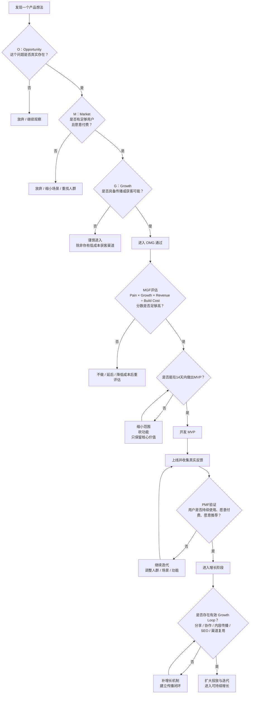

# 独立开发者产品决策框架

适合谁看：

- 有很多 AI 产品想法，但不知道先做哪个的独立开发者
- 已经开始做产品，但总觉得自己太早进入开发的人
- 想建立一套项目筛选和止损框架的人

独立开发者做 AI 产品，最容易犯的错误通常不是“做不出来”，而是“很快做出了一个不值得做的东西”。

AI 降低了开发门槛，但没有降低判断门槛。今天真正稀缺的能力，不是把产品做出来，而是在投入时间、金钱和精力之前，判断这个方向值不值得做。

所以我更在意的不是功能优先级，而是决策顺序。

一句话概括就是：

先判断有没有机会（OMG），再判断值不值得现在做（MGF），再用 MVP 验证，拿 PMF 确认市场，最后用增长闭环放大。

## 一、为什么要看“决策链”，而不是只看一个模型

很多人会直接问：“到底该用哪个模型判断产品？”

但问题不在于选一个最强模型，而在于把不同模型放回正确顺序里。

- OMG 不是全部，它只负责判断机会。
- MGF 不是 PMF，它负责判断你现在该不该投入。
- MVP 不是最终产品，它只是验证工具。
- PMF 不等于增长成立。
- Growth Loop 也不是市场验证，它解决的是能不能低成本放大。

这篇文章真正想给你的，不是几个名词，而是一条决策链。

## 二、完整决策链

```text
OMG
↓
MGF
↓
MVP
↓
PMF
↓
Growth Loop
```

它们分别解决的问题是：

|阶段|它解决什么问题|如果跳过会怎样|
|---|---|---|
|OMG|这个机会是否真实存在|容易做出“技术上很酷，但没人真需要”的产品|
|MGF|这件事值不值得现在由你来做|容易忽略资源约束，陷入高成本试错|
|MVP|能否用最小成本验证核心价值|容易在验证前过度开发|
|PMF|用户是否真的持续需要|容易把“有人夸”误判为市场成立|
|Growth Loop|能否低成本持续放大|容易在增长上靠手工硬推|

这个顺序的意义在于：每一关都在回答一个不同问题，不能互相替代。

## 三、第一关：OMG，先判断有没有机会

OMG 只看三个指标：

```text
OMG = Opportunity × Market × Growth
```

|维度|核心问题|
|---|---|
|Opportunity|这个问题是否真实存在|
|Market|是否有足够用户愿意付费|
|Growth|产品是否具备传播能力|

### 1. Opportunity

它判断的不是“你能不能做”，而是“这个问题到底真不真”。

重点看三件事：

- 用户是否在抱怨。
- 是否已经有竞品存在。
- 用户是否已经在用替代方案。

一个很实用的经验是：

> 用户已经在付钱解决的问题，通常就是真需求。

典型反例是：技术上很酷，但用户没有明显痛感，也没有替代方案，最后只能靠创作者自己想象市场。

### 2. Market

Market 看的不是抽象市场规模，而是你面对的人群是否愿意为这个问题持续付费。

重点看：

- 用户是否愿意付费。
- 这是高频还是低频需求。
- 用户数量是否足够支撑这个方向。

一个粗略经验：

|市场|付费能力|
|---|---|
|企业工具|高|
|效率工具|中|
|娱乐产品|低|

### 3. Growth

Growth 看的不是“以后再说”，而是这个产品有没有天然的传播机制。

重点看：

- 是否容易分享。
- 是否具备协作属性。
- 是否具备内容传播能力。

例如：

|产品|增长方式|
|---|---|
|Notion|模板传播|
|Figma|协作传播|
|Midjourney|作品传播|

### 4. 一个简单评分例子

假设两个产品：

产品 A：AI 会议纪要

|O|M|G|
|---|---|---|
|8|7|5|

```text
Score = 8 × 7 × 5 = 280
```

产品 B：AI 壁纸生成

|O|M|G|
|---|---|---|
|3|3|8|

```text
Score = 3 × 3 × 8 = 72
```

至少在 OMG 这一关，产品 A 更值得继续往下看。

如果 OMG 都过不了，后面做得越快，只会越快进入错误方向。

## 四、第二关：MGF，判断值不值得现在做

OMG 解决的是“有没有方向”，MGF 解决的是“这件事值不值得你现在做”。

这是最能体现独立开发者视角的一关，因为很多方向对团队成立，不一定对你成立。

我更关注四个变量：

```text
MGF = Pain × Growth × Revenue ÷ Build Cost
```

这不是为了精确计算，而是强制自己回答四个问题：

- 痛点强不强。
- 增长潜力够不够。
- 收入空间在不在。
- 构建成本是不是低到可接受。

对独立开发者来说，这一关还要额外问四个问题：

- 你能不能在短时间内做出可验证版本。
- 你有没有现成渠道拿到第一批用户。
- 你是否具备这个方向的理解优势。
- 这个产品会不会把你拖进高维护成本。

大公司可以用资源硬扛试错，独立开发者通常不行。

所以，MGF 本质上是在问：

```text
这是不是一个值得由我、在现在、以这个成本去做的项目
```

如果 MGF 不成立，更好的动作通常不是硬做，而是延后、缩小范围，或者直接放弃。

## 五、第三关：MVP，不是做小，而是做准

过了 OMG 和 MGF，才值得进入 MVP。

这里最容易犯的错是把 MVP 理解成“简陋版正式产品”。其实不是。

MVP 的目标只有一个：验证核心假设。

所以最重要的判断标准不是“功能少不少”，而是：

- 能不能在 14 天内做出来。
- 能不能在一个窄场景里体现核心价值。
- 能不能拿到真实反馈，而不是自我感觉良好。

一个常见错误是：明明只需要验证用户是否愿意持续使用，却先做了权限、后台、复杂配置、自动化流程，最后还没验证价值，时间已经烧掉了。

如果 MVP 做不出核心价值，就继续砍范围，不要加功能。

## 六、第四关：PMF，验证用户是否持续需要

MVP 上线以后，重点不是“有人说不错”，而是看产品有没有进入真正的市场反馈阶段。

我更看重这几个信号：

- 用户是否持续使用。
- 用户是否愿意付费。
- 用户是否愿意推荐。
- 用户是否在没有你推动的情况下仍然回访。

这几个信号比“朋友圈点赞”“朋友夸你做得不错”更重要。

因为 PMF 不是一句口号，而是产品从“我觉得有价值”进入“市场反复证明有价值”。

如果 PMF 不成立，不要急着放大，更合理的动作是继续调人群、场景和功能边界。

## 七、第五关：Growth Loop，决定能不能放大

很多产品不是死在价值，而是死在增长。

Growth Loop 要回答的是：如果产品成立，它能不能靠相对低成本的方式持续获客，而不是永远靠创作者自己手工去推。

要判断的是：

- 有没有分享机制。
- 有没有协作机制。
- 有没有内容传播。
- 有没有 SEO、渠道复用、模板复用这类低成本增长方式。

几种常见增长机制的差别可以简单理解为：

|机制|适合什么产品|
|---|---|
|模板传播|效率工具、创作工具|
|协作传播|团队工具、多人场景产品|
|内容传播|生成式产品、创作结果可展示的产品|
|SEO / 渠道复用|问题明确、搜索意图强的产品|

如果 Growth Loop 没有闭环，不要盲目投流，因为那往往只是把问题放大。

## 八、把框架拉回独立开发者现实

同一个产品方向，对融资团队可行，不代表对独立开发者可行。

独立开发者在判断项目时，除了市场本身，还要看：

- 时间成本。
- 现金流压力。
- 自己是否有理解优势。
- 维护成本是否会长期拖累你。

所以我更倾向于这样的原则：

> 优先做低成本验证、高信息增量的项目，而不是一开始就追求宏大目标。

换句话说，独立开发者最该追求的不是“大机会”，而是“你能抓住、能验证、能持续推进的机会”。

## 九、一个简化案例

假设你想做一个“AI 英语口语陪练产品”。

可以这样过一遍决策链：

- OMG：用户是否真的有持续口语练习的痛点，是否已经在用别的方式解决？
- MGF：你是否真的懂这个场景，是否能在短时间里做出一个可验证版本，是否拿得到第一批测试用户？
- MVP：先做“固定主题对练 + 错误反馈”，而不是先做完整学习系统。
- PMF：看用户是否持续回来练、是否愿意为长期进步付费。
- Growth Loop：看结果是否可分享、是否能形成打卡传播或内容传播。

这个例子里，最危险的地方通常不是“做不出对练”，而是太早做成一个庞大的学习平台。

## 十、每一关的止损信号

这套框架真正有用的地方，不只是告诉你怎么做，还告诉你什么时候该停。

|阶段|核心问题|没过怎么办|
|---|---|---|
|OMG|这个问题真实吗|放弃或缩场景|
|MGF|这件事值得我现在做吗|延后或降成本|
|MVP|能否快速验证核心价值|继续砍功能|
|PMF|用户是否持续需要|继续调人群/场景|
|Growth|能否低成本放大|先补增长机制|

如果这张表能真正进入你的判断流程，你做产品的速度可能不会变慢，但无效投入会少很多。

## 十一、最后再说一句

AI 时代，独立开发者最容易高估的是“开发速度”，最容易低估的是“决策质量”。

真正关键的不是做对功能，而是找对机会、控制投入、尽快验证、及时止损。

## 十二、一个可视化流程



## 继续阅读

- 如果你已经知道该做什么，下一篇看 [AI时代的需求管理](./AI%E6%97%B6%E4%BB%A3%E7%9A%84%E9%9C%80%E6%B1%82%E7%AE%A1%E7%90%86.md)，解决“怎么把目标正确翻译成场景、规格和代码”。
- 如果你想看这套方法在真实项目里为什么会被逼出来，继续看 [工程决策日志](../03-%E6%A1%88%E4%BE%8B%E5%A4%8D%E7%9B%98/%E5%B7%A5%E7%A8%8B%E5%86%B3%E7%AD%96%E6%97%A5%E5%BF%97.md)。
